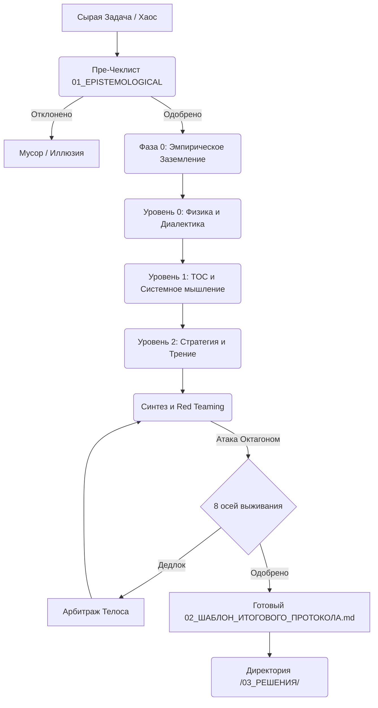

# Карта Мета-Конвейера (System Index)

Этот документ — единая точка входа и логическая карта всех артефактов проекта. Он показывает путь сырой информации (Задачи) от момента возникновения до кристаллизации в готовое решение.

---

## 🟢 УРОВЕНЬ ВХОДА: Инициализация и Правила
*Здесь задается философия проекта, точка входа и жесткие ограничения для оператора (человека или ИИ).*

*   📄 `00_README.md` — Точка входа для людей (инструкция по эксплуатации на GitHub).
*   📄 `00_CLAUDE.md` — Точка входа для автономных CLI-агентов (Claude Code).
*   📄 `00_МАНИФЕСТ_ПРОЕКТА.md` — Манифест. Концепция дезинтеграции задач и выделения Инвариантов.
*   📄 `.rules` — Конституция Конвейера (инструкции для AI-ассистентов: No Yapping, Empirical Grounding, `<thought_process>`).
*   📁 `.ai_configs/` — Директория для хранения ядра системных промптов (Single Source of Truth для `.rules` и `.cursorrules`).

---

## 🏛️ БАЗА ЗНАНИЙ: Фундаментальные Движки (Foundations)
*Теоретическое ядро. Законы природы, математики и философии, через которые пропускается хаос.*

*   📄 `01_БАЗА_ЗНАНИЙ/01_АБСОЛЮТНЫЕ_ФИЛЬТРЫ_ВХОДА.md` — **Уровень 00 (Абсолютные Фильтры).** 6 исторических вопросов (от Шумеров до Витгенштейна), отсекающих когнитивные иллюзии и языковые ошибки *до* начала работы.
*   📄 `01_БАЗА_ЗНАНИЙ/02_КОГНИТИВНЫЙ_ЛАНДШАФТ.md` — **Уровни 0, 1 и 2 (Когнитивный Ландшафт).** Трехуровневая архитектура фреймворков (Диалектика, Кибернетика, TOC, OODA, Стоицизм).
*   📄 `01_БАЗА_ЗНАНИЙ/03_ИНЖЕНЕРНЫЙ_ОКТАГОН_ВЫЖИВАНИЯ.md` — **Абсолютный Инженерный Октагон.** 8 осей выживания любой системы (Definition of Done).
*   📄 `01_БАЗА_ЗНАНИЙ/04_МАТРИЦА_КОНФЛИКТОВ_И_АРБИТРАЖ.md` — **Матрица Конфликтов.** Асинхронный симулятор для выявления архитектурных дедлоков и арбитража через Телос.
*   📄 `01_БАЗА_ЗНАНИЙ/05_ВЕКТОРЫ_МЫШЛЕНИЯ.md` — **10 Векторов Логики (Gearbox 10V).** Методология мышления (Дедукция, Индукция, Абдукция, Редукция, Синтез, Инверсия, Латераль, Парадокс, Цикличность, Резонанс) для преодоления тупиков.

---

## ⚙️ ОПЕРАЦИОННАЯ МАШИНА: Инструменты (Templates)
*Прагматичные интерфейсы для работы с Базой Знаний.*

*   📄 `02_ИНСТРУМЕНТЫ/01_АЛГОРИТМ_РАЗБОРА_ЗАДАЧИ.md` — **Инструкция по эксплуатации.** Пошаговый алгоритм UTO v5 из 5 фаз (Эмпирическое заземление -> Изоляция -> Уровень 0 -> Уровни 1-2 -> Синтез и Red Teaming).
*   📄 `02_ИНСТРУМЕНТЫ/02_ШАБЛОН_ИТОГОВОГО_ПРОТОКОЛА.md` — **Форма для заливки металла.** Жесткая структура итогового документа (Топология, Инварианты, Точка опоры, Энтропия, Алгоритм, Метрика истины).
*   📄 `02_ИНСТРУМЕНТЫ/03_АВТОНОМНЫЙ_ПАЙПЛАЙН.md` — **Web-триггер.** Единый мега-промпт для запуска полного цикла в web-версиях LLM.
*   📄 `02_ИНСТРУМЕНТЫ/04_СЕССИОННЫЙ_АНАЛИЗАТОР.md` — **Анализатор логов.** Инструмент для извлечения системных выводов (USA v5.2) из длительных AI-сессий.
*   📄 `02_ИНСТРУМЕНТЫ/05_УНИВЕРСАЛЬНЫЙ_ОПТИМИЗАТОР.md` — **Оптимизатор.** Инструмент для сжатия и рефакторинга кода по алгоритму UTO v5.

---

## 📦 ПРОДУКЦИЯ: Кристаллизованные Знания (Protocols)
*Хранилище готовых, отполированных и проверенных "Red Teaming" концептуальных решений.*

### `03_РЕШЕНИЯ/01_ОБЩИЕ_МЕТА_ПРОТОКОЛЫ/`
*Фундаментальные решения, применимые к любым процессам.*
*   📄 `001_КОГНИТИВНАЯ_ДИСЦИПЛИНА.md` — Инструкция по "взлому" ленивого мышления ИИ/человека.
*   📄 `002_АППАРАТНЫЙ_СБРОС_ЗАДАЧИ.md` — Протокол Kill Switch (защита от синдрома спасателя и нерентабельных задач).
*   📄 `003_АРХИТЕКТУРА_ДВИЖКА.md` — Снимок саморефлексии Мета-Конвейера.

### `03_РЕШЕНИЯ/02_КРОСС_ДОМЕННЫЕ_ИНВАРИАНТЫ/`
*Фундаментальные междисциплинарные законы и их проекция на инженерию и управление.*
*   📄 `001_ТЕРМОДИНАМИКА_И_МАТЕРИЯ.md` — Домен 1: Системы Материи и Энергии.
*   📄 `002_КИБЕРНЕТИКА_И_ТОПОЛОГИЯ.md` — Домен 2: Системы Информации и Управления.
*   📄 `003_ЭВОЛЮЦИЯ_И_БИОЛОГИЯ.md` — Домен 3: Биологические и Эволюционные Системы.
*   📄 `004_ТЕОРИЯ_ИГР_И_АГЕНТЫ.md` — Домен 4: Системы Агентов и Конкуренции.
*   📄 `005_КОГНИТИВИСТИКА_И_АНТРОПОЛОГИЯ.md` — Домен 5: Человеческое ПО (Восприятие и Ограничения).
*   📄 `006_СЕМАНТИКА_И_МИФОЛОГИЯ.md` — Домен 6: Семантические и Смысловые Системы.

### `03_РЕШЕНИЯ/03_ЧАСТНЫЕ_АУДИТЫ/`
*Прикладные разборы конкретных проектов и архитектур.*
*   📄 `001_АУДИТ_ПРОЕКТА_ABC.md` — Аудит проекта `abc` (Мета-рефлексия движка и валидация его конвейера).

---

## 🔄 Схема движения информации:

