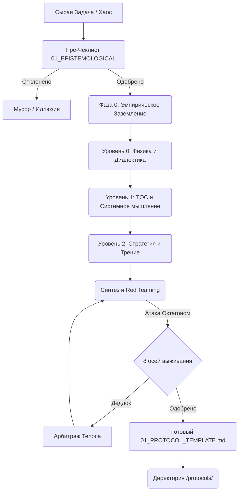

# Карта Мета-Конвейера (System Index)

Этот документ — единая точка входа и логическая карта всех артефактов проекта. Он показывает путь сырой информации (Задачи) от момента возникновения до кристаллизации в готовое решение.

---

## 🟢 УРОВЕНЬ ВХОДА: Инициализация и Правила
*Здесь задается философия проекта и жесткие ограничения для оператора (человека или ИИ).*

*   📄 `README.md` — Манифест. Концепция дезинтеграции задач и выделения Инвариантов.
*   📄 `.rules` — Конституция Конвейера (инструкции для AI-ассистентов: No Yapping, Empirical Grounding, `<thought_process>`).

---

## 🏛️ БАЗА ЗНАНИЙ: Фундаментальные Движки (Foundations)
*Теоретическое ядро. Законы природы, математики и философии, через которые пропускается хаос.*

*   📄 `foundations/00_EPISTEMOLOGICAL_PRE_CHECKLIST.md` — **Уровень 00 (Абсолютные Фильтры).** 6 исторических вопросов (от Шумеров до Витгенштейна), отсекающих когнитивные иллюзии и языковые ошибки *до* начала работы.
*   📄 `foundations/01_PROBLEM_SOLVING_LANDSCAPE.md` — **Уровни 0, 1 и 2 (Когнитивный Ландшафт).** Трехуровневая архитектура фреймворков (Диалектика, Кибернетика, TOC, OODA, Стоицизм).
*   📄 `foundations/02_UNIVERSAL_ENGINEERING_OCTAGON.md` — **Абсолютный Инженерный Октагон.** 8 осей выживания любой системы (Definition of Done).
*   📄 `foundations/03_OCTAGON_CONFLICT_MATRIX.md` — **Матрица Конфликтов.** Асинхронный симулятор для выявления архитектурных дедлоков и арбитража через Телос.

---

## ⚙️ ОПЕРАЦИОННАЯ МАШИНА: Инструменты (Templates)
*Прагматичные интерфейсы для работы с Базой Знаний.*

*   📄 `templates/00_PIPELINE_CHECKLIST.md` — **Инструкция по эксплуатации.** Пошаговый алгоритм UTO v5 из 5 фаз (Эмпирическое заземление -> Изоляция -> Уровень 0 -> Уровни 1-2 -> Синтез и Red Teaming).
*   📄 `templates/01_PROTOCOL_TEMPLATE.md` — **Форма для заливки металла.** Жесткая структура итогового документа (Топология, Инварианты, Точка опоры, Энтропия, Алгоритм, Метрика истины).

---

## 📦 ПРОДУКЦИЯ: Кристаллизованные Знания (Protocols)
*Хранилище готовых, отполированных и проверенных "Red Teaming" концептуальных решений.*

*   📄 `protocols/001_COGNITIVE_DISCIPLINE.md` — **Протокол 001.** Принудительная когнитивная дисциплина (Форсирование Системы 2). Смысловая выжимка из алгоритма UTO v5.
*   *(Здесь будут появляться следующие протоколы по мере работы Конвейера)*

---

## 🔄 Схема движения информации:

